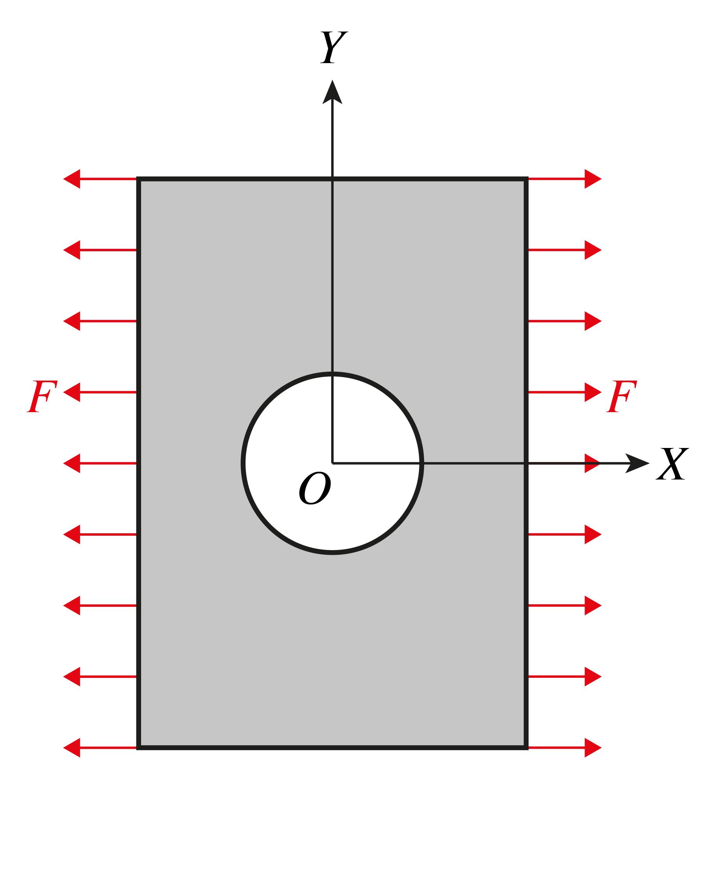
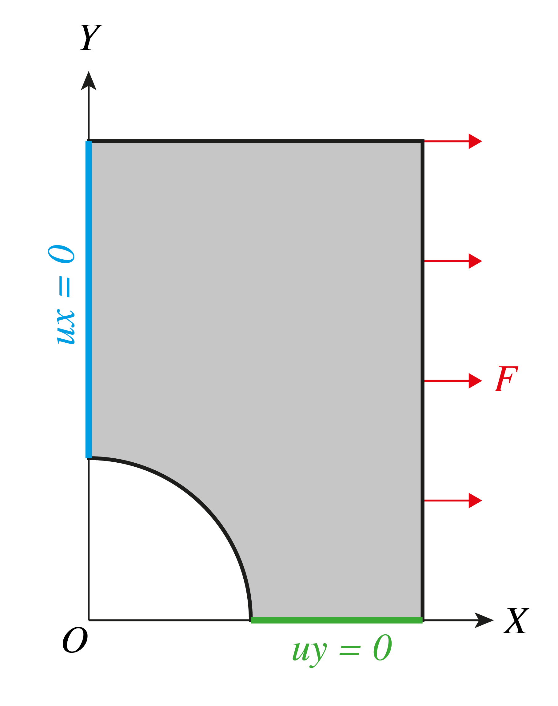

# Task for the C++ developer of the FEA computational core

## Kirsch Problem

A rectangular plate with a width of $W$ and a height of $H$, featuring a centrally located through-hole with a radius of $R$. The plate is subjected to a uniformly distributed tensile force of $F$ kN/m along the X-axis (see Fig. 1). Consider the case of plane stress (stress along the Z-axis is zero, $\sigma_{zz} = 0$) and take into account the symmetry (see Fig. 2). The material of the plate has a Poisson's ratio of $ν$ and a Young's modulus (elastic modulus) of $E$.

| Fig. 1.     | Fig. 2.  |
| ----------- | ----------- |
|  |  |

## Kirsch equations (analytical solution)
The Kirsch equations describe the elastic stresses around the hole in an infinite plate in one directional tension. They are named after [Ernst Gustav Kirsch](https://en.wikipedia.org/wiki/Ernst_Gustav_Kirsch).

Loading an infinite plate with circular hole of radius $a$ with stress $\sigma$, the resulting stress field is:

$$
\sigma_{rr} = \frac{\sigma}{2} \left( 1 - \frac{a^2}{r^2}\right) + \frac{\sigma}{2} \left( 1 + 3 \frac{a^4}{r^4} - 4 \frac{a^2}{r^2} \right) \cos 2 \theta
\\
\sigma_{\theta \theta} = \frac{\sigma}{2} \left( 1 + \frac{a^2}{r^2} \right) - \frac{\sigma}{2} \left( 1 + 3 \frac{a^4}{r^4} \right) \cos 2 \theta
\\
\sigma_{r \theta} = - \frac{\sigma}{2} \left( 1 - 3 \frac{a^4}{r^4} + 2 \frac{a^2}{r^2} \right) \sin 2 \theta
$$

### See also
- Kirsch, 1898, *Die Theorie der Elastizität und die Bedürfnisse der Festigkeitslehre.* Zeitschrift des Vereines deutscher Ingenieure, 42, 797–807.

## Requirements
- Implement the Finite Element Method (FEM) solution for the given problem. Calculate and output the normal, tangential, and principal stresses.
- Plot the stress values $\sigma_{xx}$ along the Y-axis and save the results in a CSV file.
- Use CMake for the project setup.
- (+) It would be highly beneficial to include automated tests for the functionality (Boost Test, Google Test, or without any frameworks).
- Utilize standard libraries (`std`).
- Use the [Eigen](https://eigen.tuxfamily.org/) library for matrix operations and solving the system of linear equations, both for dense and sparse matrices.
- Take a mesh without boundary conditions from `*.k` files or build it in [Gmsh](https://gmsh.info/).
- Generate boundary conditions by coordinates.

## Books
Start your acquaintance with the FEM with books:
- Zienkiewicz O. C., The Finite Element Method. Volume 1: The Basis.
- Zienkiewicz O. C., The Finite Element Method. Volume 2: Solid Mechanics.

 The first four chapters of Volume 1 will form a general idea of the method. Volume 2 deals with all kinds of non-linearity, modern shells and beams.
